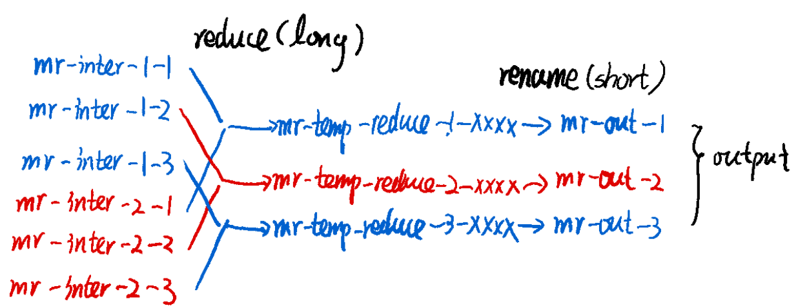

This MapReduce system designed by mit6.824 is similar to the [MapReduce paper](http://research.google.com/archive/mapreduce-osdi04.pdf), which includes a worker process that calls application Map and Reduce functions and handles reading and writing files, and a coordinator process that hands out tasks to workers and copes with failed workers.


Tests:


# General Idea

## map-reduce

map: 1 file -> reduceNum(3) intermeidate files

reduce: fileNum(2) intermediate files -> 1 reduce output

cat: reduceNum reduce outputs -> final output


## Coordinator + worker

worker: ask for 1 task, get 1 task, do the task, tell coordinator that the task is finished

coordinator: get request for 1 task, assign 1 task, set the task finished when worker finishes it


# Overview

## Worker

| No   | step                                     | operation                     | concurrency    |
| ---- | ---------------------------------------- | ----------------------------- | -------------- |
| 0    | start MapReduce job                      | call MapReduce()              | in parallelism |
| 1    | ask coordinator for a task               | call Get RPC and receive task | in parallelism |
| 2    | do the task                              | perform_map / perform_reduce  | exclusive      |
| 3    | ask coordinator to set the task finished | call Put RPC (stub the task)  | in parallelism |


### perform_map

1. read 1 file 
2. map the file into an array of kv-pairs
3. partition kv-pairs into nReduce tempFiles
4. rename tempFiles into intermediate files


### perform_reduce

1. read fileNum intermediate files and merge kv-pairs into 1 array
2. sort the array
3. compute the array into 1 tempFile
4. rename the tempFile into 1 reduce ouput file


## Coordinator

Get

| No   | step                                                   | operation                                                    | concurrency |
| ---- | ------------------------------------------------------ | ------------------------------------------------------------ | ----------- |
| 0    | receive Get RPC                                        |                                                              |             |
| 1    | if not all map tasks are done,  assign 1 map task      | receive 1 map task from map_ch, assign it to Get reply       | exclusive   |
| 2    | if not all reduce tasks are done, assign 1 reduce task | receive 1 reduce task from reduce_ch, assign it to Get reply | exclusive   |
| 3    | if all map tasks and all reduce tasks, return "Done"   |                                                              |             |

```go
func (c *Coordinator) Get(req *GetRequest, resp *GetResponse) error {
	*resp = c.WaitMap(req)
	if resp.TaskType == Map {
		return nil
	}

	*resp = c.WaitReduce(req)
	if resp.TaskType == Reduce {
		return nil
	}

	resp.TaskType = Done
	return nil
}
```

**wait for map / reduce task**

if map_ch or reduce_ch is empty, wait for a short time and check again

```
func (c *Coordinator) WaitMap(req *GetRequest) GetResponse {
	resp := GetResponse{}
	for atomic.LoadInt64(&c.nMap) != c.total_map {
		select {
		case filename := <-c.map_ch:
			if c.IsFinishedMapLock(filename) {
				continue
			}
			DPrintf("Assign Map: file %v\n", filename)
			resp.Filename = filename
			resp.Index = c.file2index[filename]
			resp.NReduce = int(c.total_reduce)
			resp.NMap = int(c.total_map)
			resp.TaskType = Map
			go c.CheckTimeOutMap(filename)
			return resp
		case <-time.After(TimeOutWaitMap):
		}
	}
	return resp
}
```

**check timeout for assigned task**

if 1 task is assigned but not finished after 20s, send it to map_ch or reduce_ch

```go
func (c *Coordinator) CheckTimeOutMap(filename string) {
	time.Sleep(TimeOutHeatBeat)
	if !c.IsFinishedMapLock(filename) {
		DPrintf("Map %v Time out!", filename)
		c.map_ch <- filename
	}
}
```


Put

| No   | step                                       | operation                              | concurrency    |
| ---- | ------------------------------------------ | -------------------------------------- | -------------- |
| 0    | receive Put RPC                            |                                        | in parallelism |
| 1    | set 1 map task / 1 reduce task as finished | set task as finished, finishedNum += 1 | exclusive      |

```go
func (c *Coordinator) Put(req *PutRequest, resp *PutResponse) error {
	switch taskType := req.TaskType; taskType {
	case Map:
		c.HandlePutMap(req)
	case Reduce:
		c.HandlePutReduce(req)
	}
	return nil
}

func (c *Coordinator) HandlePutMap(req *PutRequest) {
	c.mu.Lock()
	defer c.mu.Unlock()
	if c.map_finish[req.Filename] {
		return
	}
	c.map_finish[req.Filename] = true
	atomic.AddInt64(&c.nMap, 1)
	DPrintf("Task(Map): Filename %v Done!\n", req.Filename)
}

```


# Debug

## atomicity of map / reduce

what is temp file?

when worker is computing result for intermeidate file / reduce output file, it will take a very long time. It is necessary to temporarily store the result in a tempFile then rename it after the whole computation are done.

**Map**


**Reduce**



